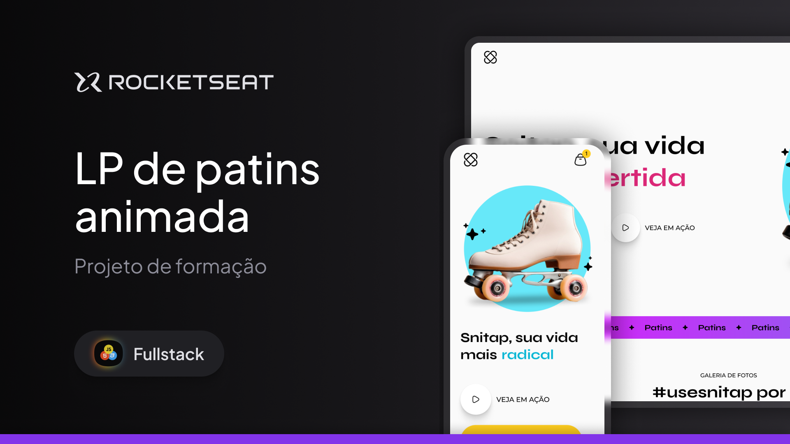

# Snitap 

 
 

**Snitap** é um site moderno e dinâmico com animações suaves, design envolvente e foco no universo dos patins.  
A proposta é oferecer uma experiência visual divertida e inspiradora para quem ama se movimentar com estilo.

## ✨ Sobre o Projeto

Este projeto tem como objetivo destacar a marca Snitap através de uma apresentação interativa, com efeitos visuais marcantes, elementos animados e uma galeria de fotos que valoriza a comunidade.

## 🎯 Funcionalidades

- Layout responsivo e moderno
- Animações fluidas e atrativas
- Galeria de imagens com usuários reais
- Destaque para produtos com chamadas visuais
- Integração com redes sociais

## 🛠 Tecnologias

- HTML5
- CSS3 (com animações personalizadas)
- Google Fonts

## 📌 Observações

Este é um projeto estático, ideal para apresentação visual de uma marca ou produto. Pode ser facilmente expandido com funcionalidades dinâmicas usando JavaScript ou frameworks modernos.
